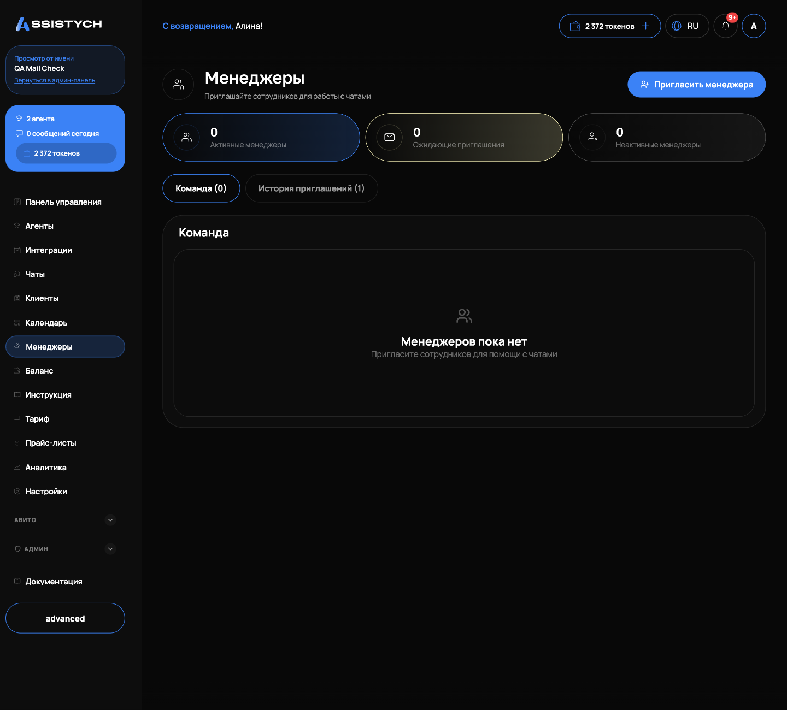

# Менеджеры и роли

Раздел «Менеджеры» нужен, чтобы дать сотрудникам доступ к кабинете без передачи своего логина и пароля. Менеджер отвечает клиентам в чатах и работает с заказами, но не видит оплату, агентов и настройки бизнеса. Раздел доступен только владельцу: у менеджера пункта «Менеджеры» в меню нет.

## Роли в кабинете

В кабинете две пользовательские роли.

Владелец. Видит всё: «Панель управления», «Агенты», «Интеграции», «Чаты», «Клиенты», «Календарь», «Менеджеры», «Баланс», «Тариф», «Прайс-листы», «Аналитика», «Настройки» и группу «Авито». Только владелец управляет менеджерами.

Менеджер. В левом меню видит три раздела: «Чаты», «Календарь» и «Настройки». В «Настройках» менеджеру доступны только личные данные, привязка Telegram и настройки уведомлений: блоки «Настройки бизнеса», «API-ключи», реквизиты и «Опасная зона» скрыты. Создавать и менять агентов, смотреть баланс и аналитику менеджер не может.

Выбора роли при приглашении нет: каждый приглашённый сотрудник получает роль менеджера.

## Раздел «Менеджеры»

Откройте «Менеджеры» в левом меню. Сверху три счётчика: «Активные менеджеры», «Ожидающие приглашения», «Неактивные менеджеры». Ниже две вкладки:

- «Команда»: список сотрудников с именем, почтой и кнопками управления;
- «История приглашений»: все созданные приглашения с их статусами.

Если сотрудников ещё нет, страница показывает заглушку «Менеджеров пока нет» с подсказкой «Пригласите сотрудников для помощи с чатами».

## Приглашение менеджера

1. Нажмите «Пригласить менеджера» в правом верхнем углу.
2. В диалоге «Пригласить менеджера» заполните поле «Почта менеджера (необязательно)». Почту можно не указывать: письма-приглашения система не отправляет, работает именно ссылка.
3. Нажмите «Создать приглашение».
4. Появится ссылка-приглашение. Скопируйте её кнопкой копирования и отправьте сотруднику любым удобным способом. Кнопки «Пригласить ещё» и «Готово» закрывают диалог.

Ссылка действует 24 часа. Если сотрудник не успел, создайте новое приглашение.

[скриншот: диалог «Пригласить менеджера» со ссылкой-приглашением]

## Как менеджер принимает приглашение

Сотрудник открывает ссылку и попадает на страницу «Присоединиться к {название вашей компании}». Он заполняет форму:

- «Ваше имя»;
- «Логин»: латиницей, без пробелов, по нему он будет входить, почта не нужна;
- «Придумайте пароль»: минимум 8 символов;
- «Подтвердите пароль».

Кнопка «Создать аккаунт» завершает регистрацию, дальше сотрудник входит своим логином и паролем. Если ссылка недействительна, уже использована, отозвана или истекла, страница скажет об этом прямо: «Эта ссылка приглашения недействительна или уже использована», «Срок действия приглашения истёк», «Это приглашение было отозвано владельцем бизнеса».

## История приглашений

На вкладке «История приглашений» каждое приглашение показано с почтой (если указана), датой создания и статусом:

- «Ожидает»: ссылка создана, но ей ещё не воспользовались. Видно и время, когда она истекает;
- «Принято»: сотрудник создал аккаунт;
- «Истекло»: прошло 24 часа;
- «Отозвано»: вы отменили приглашение.

Для ожидающего приглашения доступны две кнопки: «Скопировать» (ссылку можно отправить повторно, пока она действует) и крестик «Отозвать». Отзыв спрашивает подтверждение «Вы уверены, что хотите отозвать приглашение?», после отзыва ссылка перестаёт работать.

Отдельной кнопки «отправить приглашение ещё раз» нет: если ссылка истекла, создайте новое приглашение кнопкой «Пригласить менеджера».

## Отключение и удаление менеджера

Во вкладке «Команда» у каждого менеджера две кнопки.

«Деактивировать». Менеджер сразу теряет возможность войти, появляется подтверждение «{email} больше не может войти». Аккаунт и его история сохраняются, в списке он виден с пометкой «Неактивные менеджеры». Кнопка «Активировать» возвращает доступ.

«Удалить» (иконка корзины). Удаляет менеджера безвозвратно, с подтверждением «Вы уверены, что хотите удалить этого менеджера?». Если сотрудник понадобится снова, придётся приглашать его заново.

Временно закрыть доступ на отпуск или проверку удобнее деактивацией, а не удалением.

## Если что-то пошло не так

- Сотрудник говорит, что ссылка не работает. Посмотрите статус в «Истории приглашений»: «Истекло» или «Отозвано» значит, что нужно создать новое приглашение.
- Письмо с приглашением не пришло. Так и задумано: письма не отправляются, передайте сотруднику скопированную ссылку сами.
- Менеджер не видит нужный раздел. Это ограничение роли: менеджеру доступны только «Чаты», «Календарь» и «Настройки». Изменить роль сотрудника в кабинете нельзя.
- Раздел «Менеджеры» показывает «Доступ запрещён». Вы вошли под учётной записью менеджера, управлять командой может только владелец.
- Менеджер не может войти. Проверьте, не деактивирован ли он во вкладке «Команда», и нажмите «Активировать».
