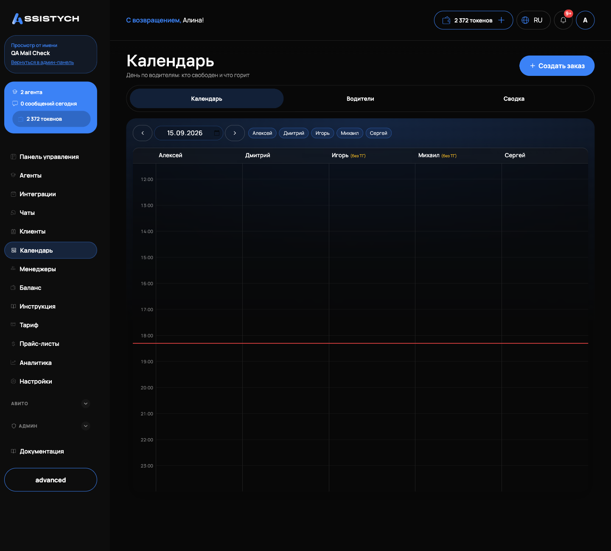
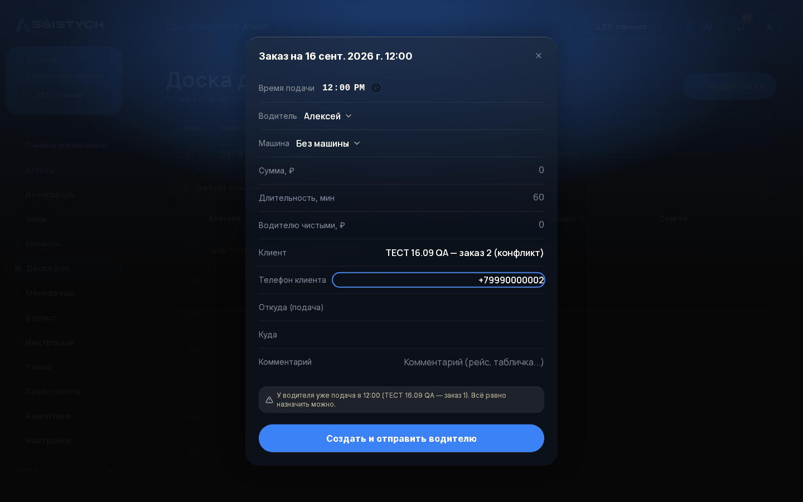
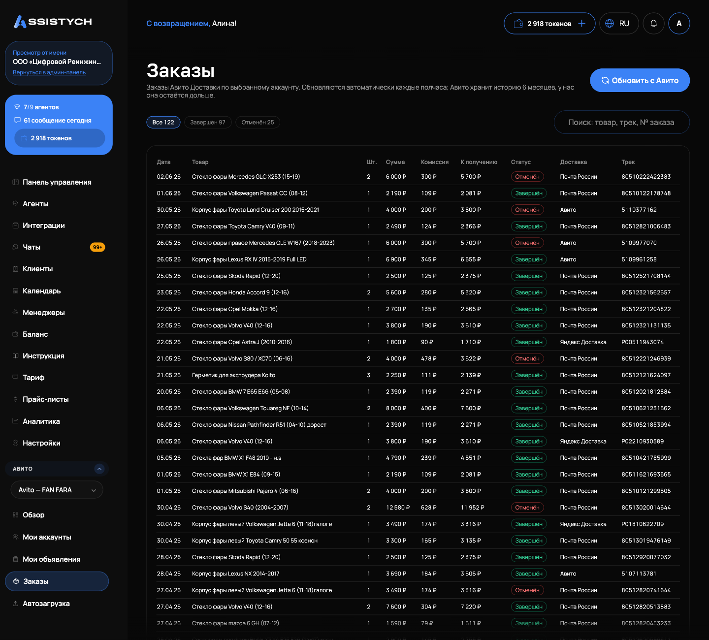

# Календарь и заказы

Это диспетчерский модуль: календарь дня по водителям, создание заказов, назначение исполнителей и контроль выполнения. Подходит бизнесу, где клиента нужно куда-то отвезти или что-то доставить в назначенное время. Точка входа: пункт «Календарь» в левом меню. Отдельно в группе «Авито» есть раздел «Заказы»: это реестр заказов Авито Доставки, о нём в конце страницы.

Календарь работает поверх интеграции онлайн-записи. Если она не подключена, страница покажет подсказку «Подключите онлайн-запись в магазине интеграций: календарь работает поверх неё» и кнопку «В магазин интеграций».

## Календарь дня

Страница отвечает на вопрос «кто свободен в 14:40». Вверху три вкладки: «Календарь», «Водители» и «Сводка».

На вкладке «Календарь»:

- переключатель даты: стрелки «назад» и «вперёд», поле даты и кнопка «Сегодня», если вы ушли на другой день;
- сетка дня: слева часы, справа колонки водителей. Шаг сетки 15 минут, на сегодняшнем дне красной линией отмечено текущее время;
- колонка «Без водителя»: заказы, которым исполнитель ещё не назначен. Она появляется, если такие заказы есть;
- пометка «(без ТГ)» у имени водителя: он не привязал Telegram, карточка заказа ему не уйдёт;
- нажатие на имя водителя над сеткой скрывает или показывает его колонку, удобно, когда водителей много.

На экране телефона вместо сетки показывается лента заказов дня по времени.

Заказ в сетке выглядит блоком с временем и адресом подачи (или именем клиента). Цвет блока подсказывает состояние: спокойные тона у закрытых заявок, красный у опозданий и отказов, жёлтый там, где водитель ещё не подтвердил заказ.

## Полоса «Требует внимания»

Если в дне есть проблемные заказы, над сеткой появляется полоса «Требует внимания» со счётчиками:

- «опаздывает: N»: водитель нажал «Опаздываю»;
- «отказ: N»: водитель отказался от заказа;
- «без ответа: N»: карточка отправлена, но водитель не нажал ни «Беру», ни «Не смогу»;
- «не доставлено: N»: водитель назначен, но карточка ему не ушла (например, нет привязки к боту);
- «без водителя: N»: заказ ждёт назначения;
- «требует закрытия: N»: время подачи прошло больше трёх часов назад, а заказ всё ещё в статусе «Ожидает» или «Подтверждён».

## Создание заказа

Есть два способа: кнопка «Создать заказ» в правом верхнем углу или клик по свободному месту сетки в колонке нужного водителя, время подставится по месту клика с округлением до 15 минут.

Откроется диалог «Заказ на {дата} {время}». Поля:

- время и водитель (список начинается с «Без водителя»; водители с привязанным Telegram идут первыми, у остальных пометка «(без ТГ)»);
- машина или услуга, если заведены: вариант по умолчанию «Без машины/услуги»;
- «Сумма, ₽»;
- «Имя клиента»: обязательное поле;
- «Телефон клиента»;
- «Откуда (подача)» и «Куда»;
- «Комментарий (рейс, табличка...)».

Кнопка внизу зависит от выбора водителя. Без водителя: «Создать», появится подтверждение «Заказ создан». С водителем: «Создать и отправить водителю», подтверждение «Заказ создан, карточка отправлена водителю».

Если у выбранного водителя уже есть подача в пределах полутора часов, появится жёлтое предупреждение: «У водителя уже подача в {время} ({место}). Всё равно назначить можно». Это предупреждение, а не запрет: создать заказ можно.

## Карточка заказа и назначение водителя

Клик по заказу в сетке открывает его карточку. В ней видно маршрут, телефон клиента, комментарий и строку состояния по водителю:

- «Карточка отправлена, ждём ответа»;
- «Карточка не отправлена» (водитель назначен, но не привязан к боту);
- «Взял заказ», «Отказался», «Выехал», «Опаздывает»;
- «Выполнена» или «Выполнена (отметил водитель)», «Оплачена».

Здесь же можно поменять водителя, машину/услугу и сумму. Главная кнопка внизу меняет подпись по ситуации:

- «Назначить и отправить»: выбран новый водитель, ему уйдёт карточка;
- «Отправить снова»: водитель тот же, но карточка ещё не была доставлена;
- «Сохранить»: просто сохранить изменения.

Чтобы снять назначение, выберите в поле водителя «Без водителя» и сохраните: заказ уйдёт в колонку «Без водителя».

Кнопки закрытия заказа: «Выполнена» («Заявка отмечена выполненной»), «Оплачена» («Заявка отмечена оплаченной») и «Отменить заказ». При отмене приходит подтверждение «Заказ отменён, водителю отправлено "ехать не надо"». Отменённые заказы исчезают из сетки дня.

## Водители

Вкладка «Водители» на странице календаря: это справочник исполнителей и ресурсов. Старый адрес /drivers теперь просто перенаправляет сюда.

Кнопка «Добавить» открывает диалог «Добавить в справочник»:

- тип записи: «Водитель», «Сотрудник», «Машина», «Услуга» или «Товар». Водители и сотрудники становятся колонками календаря, машины и услуги доступны во втором поле заказа;
- «Имя, например Пётр»;
- «Телефон (не обязательно)»: только для исполнителей;
- «Комментарий (класс машины, график, заметки)».

На карточке водителя виден статус «Подключён к боту» или «Не подключён к боту». Кнопка «Пригласить в телеграм» создаёт одноразовую ссылку и сразу копирует её в буфер обмена («Ссылка скопирована: отправьте её водителю»). Водитель переходит по ссылке, и его Telegram привязывается. Переключатель «Работает» / «Не работает» временно убирает водителя из сетки и списков выбора, не удаляя запись. Кнопка «Изменить» открывает ту же форму для правки.

Пока справочник пуст, календарь показывает заглушку «Водителей ещё нет: добавьте первого, и появится сетка дня» с кнопкой «Добавить водителя».

## Что видит водитель

Водитель получает карточку заказа в Telegram от сервисного бота. В карточке: день и «подача в {время}», строка «Подготовка с …» (если задана), «Откуда», «Куда», «Машина», «Клиент» и «Комментарий». Под карточкой две кнопки: «Беру» и «Не смогу». При отказе бот предложит причины на выбор: «Занят», «Далеко», «Машина».
После «Беру» карточка обновляется: «✅ Заказ ваш», появляется телефон клиента и кнопка «Выполнил ✓». Перед подачей бот присылает напоминание с кнопками «Выезжаю» и «Опаздываю»: нажатие «Опаздываю» сразу помечает заказ в календаре диспетчера.

Все действия водителя видны в карточке заказа в кабинете: «Взял заказ», «Выехал», «Опаздывает», «Выполнена (отметил водитель)».

Те же заказы водитель видит в мини-приложении: список активных заказов, ближайшие сверху, с теми же действиями (взять, отказаться с причиной, выехал, опаздываю, выполнил). Подробнее: [Мини-приложение в Telegram и MAX](../integrations/mini-app.md).

## Вкладка «Сводка»

Вкладка «Сводка» на странице календаря показывает статистику заказов по выбранной интеграции онлайн-записи.

## Заказы Авито Доставки

Отдельный раздел «Авито» → «Заказы» показывает заказы Авито Доставки по выбранному Авито-аккаунту. Это реестр только для чтения: создавать и менять здесь ничего нельзя. Данные обновляются автоматически каждые полчаса; Авито хранит историю 6 месяцев, в кабинете она остаётся дольше. Кнопка «Обновить с Авито» запускает обновление вручную и показывает итог: «Получено …, новых …, изменилось …».

Над таблицей фильтры по статусам с количеством: «Все», «Ждёт подтверждения», «К отправке», «В пути», «Прибыл в ПВЗ», «Доставлен», «Завершён», «Отменён». Поле «Поиск: товар, трек, № заказа» ищет по реестру.

Таблица показывает по каждому заказу: «Дата», «Товар», «Шт.», «Сумма», «Комиссия», «К получению», «Статус», «Доставка», «Трек». Если заказов несколько на страницу, внизу работает перелистывание. Если аккаунт не выбран, страница просит выбрать Авито-аккаунт в переключателе слева. Подключение аккаунта: [Подключение Авито](../getting-started/connect-avito.md).

## Если что-то пошло не так

- Страница пишет «Не удалось загрузить заказы. День может быть не пустым». Это сбой загрузки, а не пустой день: нажмите «Повторить».
- Карточка заказа не уходит водителю. У водителя пометка «(без ТГ)»: отправьте ему приглашение кнопкой «Пригласить в телеграм» на вкладке «Водители», затем в карточке заказа нажмите «Отправить снова».
- Водитель не видит кнопок в Telegram. Карточки приходят от сервисного бота, водителю нужно перейти по пригласительной ссылке и не блокировать бота.
- Сетка дня не появляется. Пока в справочнике нет ни одного работающего водителя, календарь показывает только заглушку: добавьте водителя.
- Кнопка создания заказа неактивна. Не заполнено обязательное поле «Имя клиента».
- В разделе «Заказы» Авито пусто. Проверьте, что выбран нужный аккаунт и у него включена Авито Доставка, затем нажмите «Обновить с Авито».
