# Заказы и водители (простой режим)

Это отдельный, более простой способ вести заказы — пилот для служб с личным каналом водителей в Telegram (например, трансфер). В отличие от календаря дня из предыдущего раздела, здесь нет справочника машин и слотов: заказ уходит постом в канал, водители откликаются сами, а бот следит, чтобы назначенный водитель подтвердил подачу.

*Скриншоты на этой странице сняты на тестовом аккаунте — на них видны имя «Диспетчер (тест)», тестовый заказ «ТЕСТ 17.09 coord2» и счётчик чатов «99+»: в своём кабинете вы увидите собственные данные.*

## Что это вообще

Вы создаёте заказ (из переписки с клиентом или с нуля), нажимаете «Опубликовать» — и заказ уходит постом в ваш закрытый канал водителей в Telegram. Водители откликаются кнопкой под постом, отклики приходят вам в Telegram-бот и в карточку заказа. Вы выбираете, кому отдать заказ, — дальше бот сам напоминает водителю о подаче и следит, чтобы он подтвердил выезд.

Слева в меню: **Заказы**.

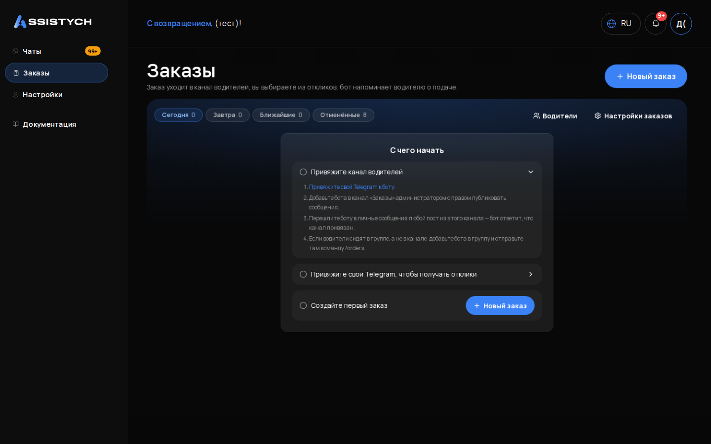

## 1. Привязать канал и бота (один раз)

Без этого шага заказы некуда публиковать, а отклики вам не придут. Всё настраивается за 5 минут в **Заказы → Настройки заказов** (или прямо на главной «Заказов» в блоке «С чего начать»).

[скриншот: настройки заказов, блоки «Канал водителей» и «Бот диспетчера»]

**Привязать свой Telegram к боту** (чтобы получать отклики и тревоги):

1. Нажмите «Привязать Telegram» — откроется бот.
2. Нажмите в боте «Старт». Готово: отклики водителей и тревоги «водитель не подтвердил подачу» теперь приходят вам в Telegram.

**Привязать канал водителей:**

1. Добавьте бота в ваш канал «Заказы» администратором с правом публиковать сообщения.
2. Перешлите боту в личные сообщения любой пост из этого канала — бот ответит, что канал привязан.
3. Если водители сидят в группе, а не в канале: добавьте бота в группу и отправьте там команду `/orders`.

Проверка, что всё связано: откройте «Заказы» — жёлтых предупреждений «канал не привязан» / «Telegram не привязан» быть не должно.

## 2. Создать заказ из чата

Клиент написал вам в Авито — заказ создаётся прямо из переписки:

1. Откройте чат с клиентом в разделе «Чаты».
2. Справа нажмите вкладку «Создать заказ» (рядом с «Информация о клиенте»). [скриншот: деталка чата, вкладка «Создать заказ»]
3. Откроется форма «Заказ из чата». Первые пару секунд она показывает заглушку «Читаем переписку и заполняем заказ…» — просто подождите, форму не закрывайте.

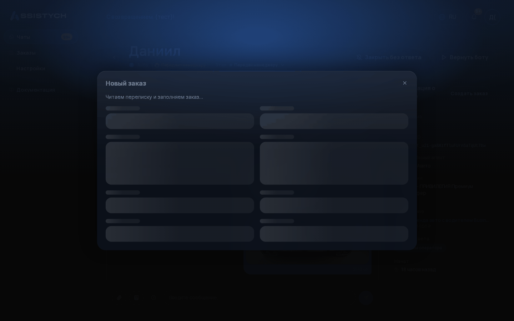

4. Форма сама заполнится из переписки: дата и время подачи, маршрут, что за машина, почасовка и часы, пассажиры, повод, комментарий, имя клиента. Чего клиент не называл (обычно это цена и телефон), останется пустым — это нормально.

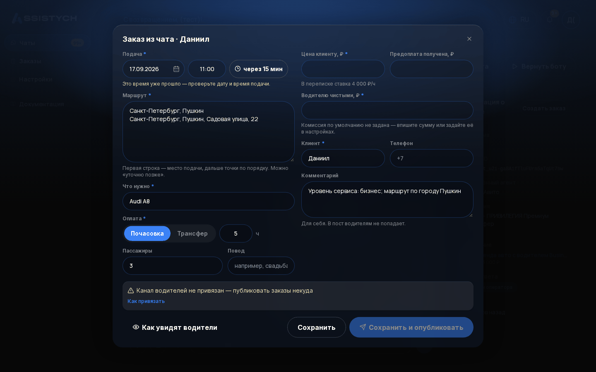

5. Если программа в чём-то не уверена, рядом с полем будет метка «проверьте» с цитатой из переписки — например, у «Подачи»: «В переписке: "около 13 часов дня"», у «Повода»: «В переписке: "до 1 загса"». Такие поля сверьте глазами обязательно.

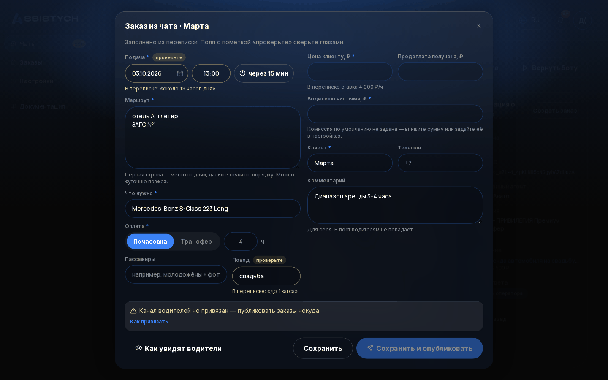

6. Под полем цены может быть подсказка вида «В переписке ставка 4 000 ₽/ч» — саму цену программа не подставляет, её решаете вы.
7. Если подача попала на время, которое уже прошло (клиент писал вчера), форма честно напишет «Это время уже прошло — проверьте дату и время подачи».
8. Проверьте и поправьте поля (что обязательно — ниже) и нажмите «Сохранить» или «Сохранить и опубликовать».

Тот же заказ можно создать без чата: **Заказы → «+ Новый заказ»**. С телефона всё то же самое — форма открывается на весь экран, все поля на месте.

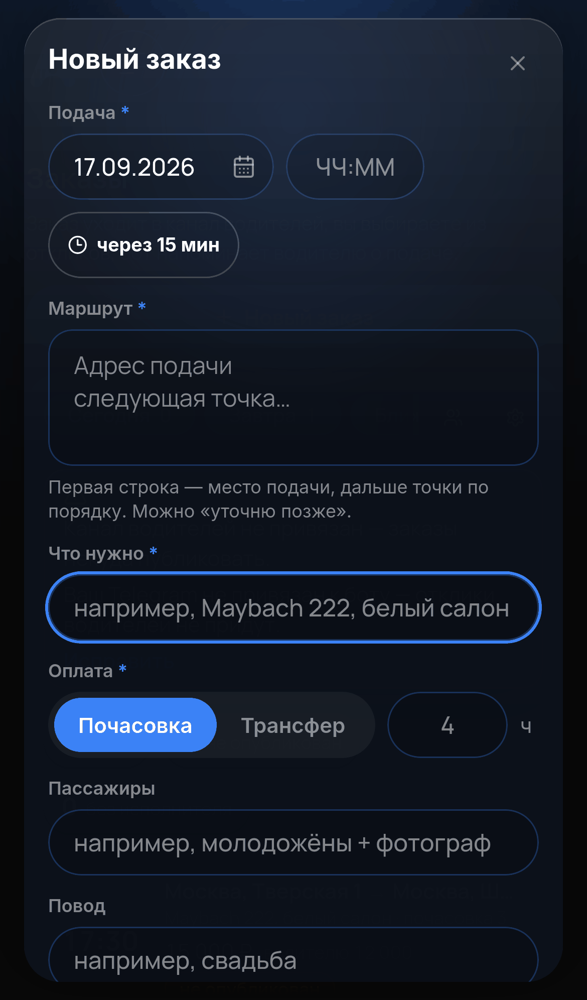

**Поля формы:**

- **Подача** — дата и время. Есть кнопка «через 15 минут» для срочных.
- **Маршрут** — первая строка: где подать машину, дальше точки по порядку. Если клиент ещё не решил — честно пишите «уточню позже».
- **Что нужно** — класс/модель, цвет, количество: «Maybach 222, белый салон», «2 × Lixiang L9».
- **Оплата** — «Почасовка» (укажите часы) или «Трансфер» (фикс).
- **Пассажиры** и **Повод** — необязательно, но водителю помогает: «молодожёны + фотограф», «свадьба».
- **Цена клиенту** — сколько берёте с клиента.
- **Водителю чистыми** — считается само как цена минус комиссия из настроек; всегда можно поправить руками. Если под полем жёлтая строка «Комиссия по умолчанию не задана» — задайте её в настройках (раздел 8) или впишите сумму вручную.
- **Предоплата получена** — если клиент внёс.
- **Клиент** — имя обязательно, телефон по желанию (клиенты редко его дают — не страшно).
- **Комментарий** — только для вас, в пост водителям не попадает.

Если машин несколько (кортеж) — на каждую машину свой заказ: откройте карточку первого и нажмите «Дублировать». Откроется «Копия заказа»: все поля на месте, дата подсвечена и под ней напоминание «Дата и время скопированы — поменяйте, если копия на другую подачу», предоплата сброшена. Поправьте дату и «Что нужно» — готово.

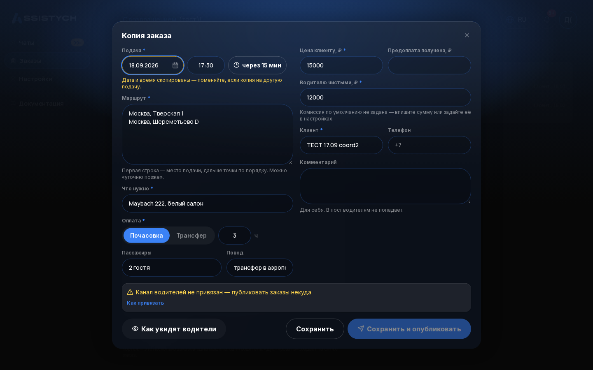

## 3. Опубликовать заказ

В карточке заказа нажмите «Опубликовать».

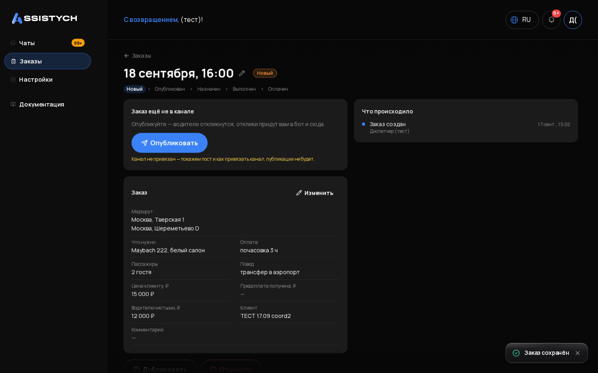

Перед отправкой откроется окно «Пост в канал водителей» — это текст поста целиком, ровно так, как его увидят водители. Текст можно поправить руками прямо в этом окне: в канал уйдёт именно то, что вы видите. Имя и телефон клиента в пост не попадают.

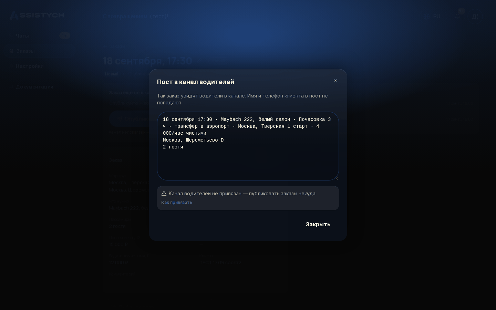

Посмотреть пост можно и до сохранения заказа: в форме слева внизу ссылка «Как увидят водители». Обратно в форму — «← К форме», заполненные поля не потеряются.

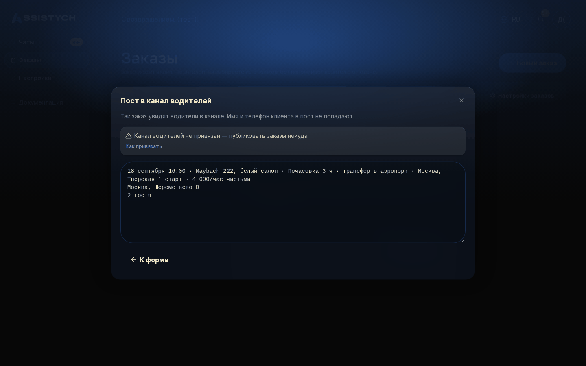

Пост короткий, без лишних слов, например:

```
16:45
Волковский проспект 6 (От Премьера)
Пулково
2 человека, 2 чемодана
Maybach 222
5 000 · водителю 4 000
```

Под постом у водителей кнопка «Откликнуться». Статус заказа меняется на «Опубликован» — в списке видно «ждём откликов», а потом «N откликов, выберите».

Если канал не привязан, кнопка «Опубликовать» всё равно на месте, но под ней написано: «Канал не привязан — покажем пост и как привязать канал, публикации не будет». По нажатию вы увидите сам пост и пошаговую инструкцию «Как привязать» (4 шага) — публикации не случится, пока канал не привязан (раздел 1).

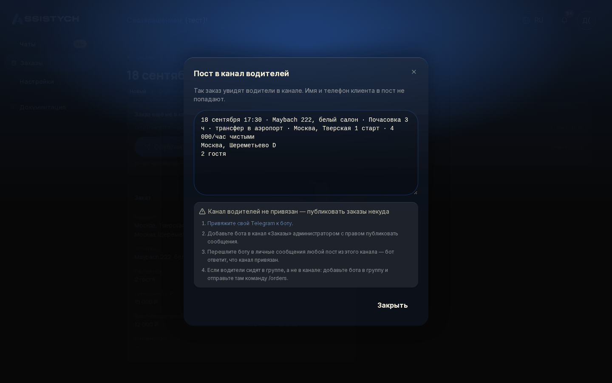

**Поправить заказ после создания:** в карточке — кнопка «Изменить». А если нужно перенести только подачу, нажмите карандаш рядом с датой и временем вверху карточки: откроется маленькое окно «Перенести подачу» с датой, временем и кнопкой «Сохранить» — без большой формы. Все правки видны в ленте «Что происходило» справа в карточке.

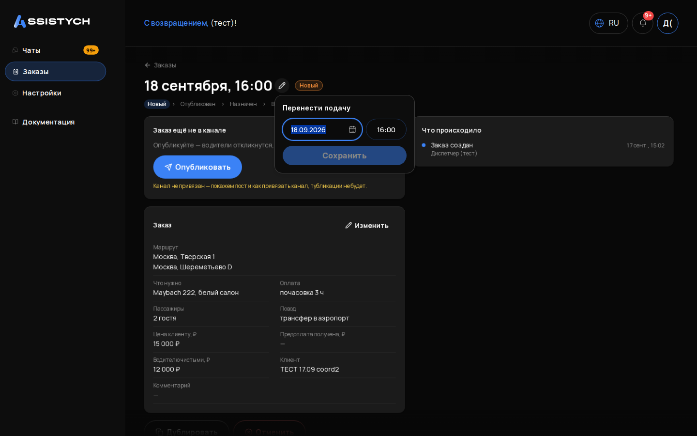

## 4. Выбрать водителя из откликов

Водитель нажал «Откликнуться» → вам в Telegram приходит карточка: «Отклик на заказ 16:45 Пулково: Иван Петров, @ivan, выполнил у нас: 3» — и кнопка «Подтвердить» прямо под ней. Тот же список откликов есть в карточке заказа в кабинете.

Нажмите «Подтвердить» (в боте или в кабинете) у выбранного:

- выбранный водитель получает карточку заказа с телефоном клиента и кнопками «Отказаться» / «Выполнил»;
- остальные откликнувшиеся получают вежливое «заказ отдан другому водителю»;
- пост в канале меняется на «✅ Исполнитель найден»;
- заказ становится «Назначен».

Можно и без откликов: назначить водителя руками из списка «Водители» (например, позвонили кому-то напрямую). Если назначили ошибочно — «Снять» в карточке заказа, водителю придёт «Диспетчер снял вас с заказа».

Если назначенный водитель отказался сам: заказ возвращается в «Опубликован», пост в канале снова «Актуально, ищем водителя», а вам в бот приходит «Иван отказался: <причина>. Остальные кандидаты: …» с кнопками «Подтвердить» по каждому — выбрать замену можно одним нажатием, ничего заново публиковать не надо.

## 5. Что приходит водителю

- **Отклик:** «Отклик принят. Диспетчер выберет исполнителя, ответ придёт сюда». Повторное нажатие: «Ваш отклик уже учтён». Если исполнитель уже выбран: «Исполнитель уже выбран».
- **Назначение:** карточка заказа (время, маршрут, что за машина, сколько чистыми, телефон клиента) + кнопки «Отказаться» и «Выполнил».
- **Напоминания:** за сутки, за 2 часа и за 30 минут до подачи — карточка заказа с кнопками «Подтверждаю» / «Отказаться».
- **Если не выбрали:** одна строка «заказ отдан другому водителю».

Новый водитель, который откликнулся впервые, появляется в списке «Водители» сам — заводить его руками не нужно. Там же можно поправить имя и телефон или выключить водителя тумблером «Работает».

[скриншот: раздел «Водители», список исполнителей]

## 6. Напоминания и что делать при молчании

Бот сам напоминает назначенному водителю три раза: за сутки, за 2 часа и за 30 минут до подачи (интервалы можно поменять в настройках). В карточке заказа, в ленте «Что происходило» справа, видно, когда ушло каждое напоминание и когда водитель нажал «Подтверждаю» — это ваш ответ на вопрос «а он точно приедет?».

Если через 30 минут после напоминания «за 2 часа» водитель молчит, вам в Telegram приходит тревога: «Иван не подтвердил подачу 16:45 Пулково. Позвонить: +7…» — и кнопка «Снять и опубликовать заново», если не дозвонились. Так что молчание водителя не останется незамеченным.

## 7. Отмена

В карточке заказа — «Отменить», укажите причину («клиент передумал», «перенос на другой день»…).

[скриншот: диалог отмены заказа с указанием причины]

- Если заказ ещё не был опубликован — никому ничего не уйдёт.
- Если был пост в канале — он отредактируется на «❌ Отменён».
- Если был назначен водитель — ему придёт сообщение об отмене.

Отменённые заказы лежат на вкладке «Отменённые» — там видно причину. Перепутали — создайте заново через «Дублировать» из карточки отменённого.

## 8. Настройки

**Заказы → Настройки заказов.** Здесь только то, что нужно для работы через канал:

- **Канал водителей** — статус привязки и инструкция, как привязать (раздел 1).
- **Бот диспетчера** — привязка вашего Telegram (раздел 1).
- **Комиссия по умолчанию** — в ₽ или %: «Водителю чистыми» в форме заказа считается как цена минус эта комиссия (сумму всегда можно поправить в самом заказе). [скриншот: настройки заказов, блок «Комиссия по умолчанию»]
- **Напоминания водителю** — интервалы напоминаний (по умолчанию за 24 ч, 2 ч и 30 минут).
- **Уведомления клиенту** — три тумблера: писать ли клиенту при подтверждении, переносе и отмене заказа. Важно: если заказ создан из чата с клиентом и тумблер включён, клиенту в Авито уйдёт сообщение. Пока привыкаете — держите выключенными и пишите клиенту сами, как привыкли.

***

### Шпаргалка на один экран

1. Настройки → привязать Telegram и канал (один раз).
2. Чат с клиентом → «Создать заказ» → подождать, пока форма заполнится сама → проверить поля, особенно с меткой «проверьте» → «Сохранить и опубликовать».
3. Отклики в Telegram → «Подтвердить» выбранному.
4. Следить за «Подтверждаю» водителя в карточке; при тревоге — звонить, при нужде «Снять и опубликовать заново».
5. После поездки: водитель жмёт «Выполнил» (или вы в карточке) → отметить «Оплачен».
