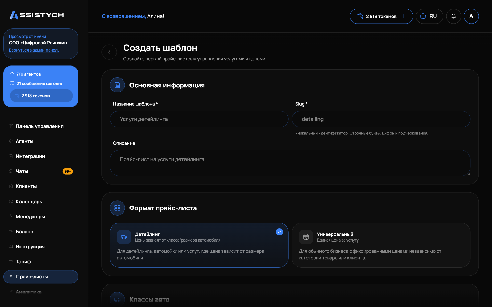
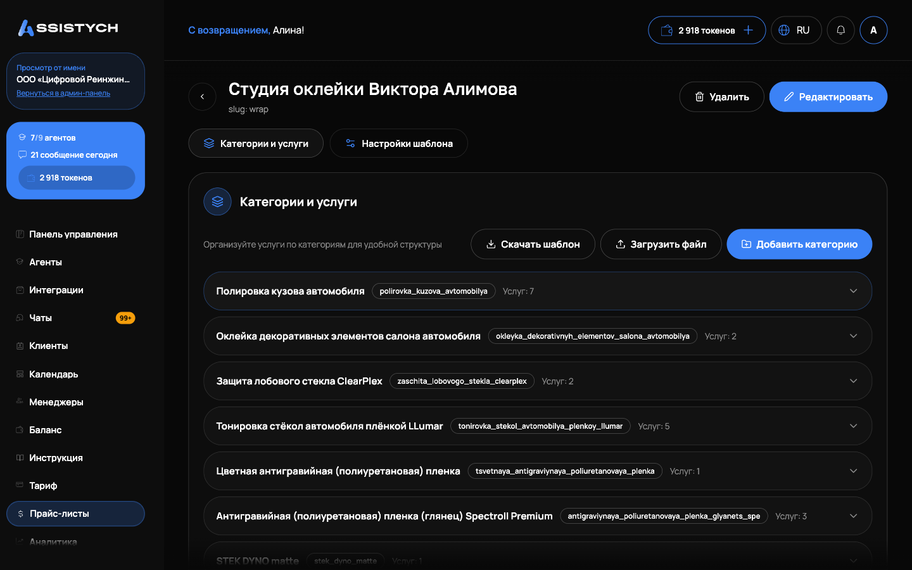

# Прайс-листы

Прайс-лист: это список ваших услуг с ценами, по которому отвечает ИИ-агент. Клиент спрашивает в чате «сколько стоит», агент находит услугу в прайс-листе и называет цену. Эта страница: как создать прайс-лист, заполнить услуги и привязать его к агенту.

Раздел открывается из меню, пункт «Прайс-листы».

## Как устроен прайс-лист

Прайс-лист состоит из категорий, внутри категорий лежат услуги. У прайс-листа есть формат:

- «Универсальный»: единая цена за услугу. Для обычного бизнеса с фиксированными ценами независимо от категории товара или клиента.
- «Детейлинг»: цены зависят от класса/размера автомобиля. Для детейлинга, автомойки или услуг, где цена зависит от размера автомобиля. У каждой услуги своя цена для каждого класса.

На главной странице раздела видны все прайс-листы с числом услуг («Услуг: …») и статусом («Активен» или «Неактивен»).

## Создание прайс-листа

1. Нажмите «Создать прайс-лист».
2. Заполните «Основную информацию»: «Название» (например, «Услуги детейлинга»), «Slug *» (уникальный идентификатор: строчные буквы, цифры и подчёркивания, начинается с буквы) и «Описание».
3. Выберите «Формат прайс-листа»: «Универсальный» или «Детейлинг».
4. Для формата «Детейлинг» задайте классы: поле «Добавить новый класс...». Видно «Определено классов: … из 10», больше 10 классов добавить нельзя. Для каждого класса потом задаётся своя цена.
5. Нажмите «Создать шаблон». Появится «Шаблон цен успешно создан».

## Категории и услуги

Откройте прайс-лист из списка. Вкладка «Категории и услуги»: основная работа здесь.

Категория. Кнопка «Добавить категорию». Заполните «Внутреннее имя» и «Отображаемое имя» (например, «Услуги полировки») и описание. Категории объединяют связанные услуги, чтобы агенту было проще ориентироваться.

Услуга. Кнопка «Добавить услугу» внутри категории. Поля:

- «Название услуги» (например, «Полировка кузова»);
- «Фиксированная цена (если не зависит от класса)»: одна цена для всех;
- «Цена от (минимальная цена, если переменная)»: когда точной цены нет;
- «Цены по классам»: для формата «Детейлинг», своя цена для каждого класса;
- «Заметки для агента»: дополнительная информация для AI-агента, клиент её не видит. Сюда пишите нюансы: что входит в услугу, когда цена меняется.

Важно: используйте либо фиксированную цену, либо «Цена от», но не обе сразу. Без цены услугу сохранить нельзя: «Укажите цены по классам или фиксированную цену».

Услугу и категорию можно редактировать и удалять. Удаление категории убирает и все её услуги, поэтому спрашивает подтверждение. Удаление всего прайс-листа тоже с подтверждением: «Все категории и услуги будут удалены».

Лимита на число услуг в кабинете нет.

## Импорт из Excel

Заполнять десятки услуг руками не обязательно. На странице прайс-листа есть импорт:

1. Нажмите «Скачать шаблон»: скачается файл .xlsx, уже заполненный текущими услугами прайс-листа. Его же удобно использовать как выгрузку прайса.
2. Отредактируйте файл в Excel: добавьте или измените строки.
3. Нажмите «Загрузить файл» и перетащите .xlsx в область загрузки (или выберите файл кнопкой).
4. После импорта виден отчёт: «Создано», «Обновлено», «Ошибки». Строки с ошибками не мешают остальным.

## Классы авто

Для формата «Детейлинг» нужен классификатор: какую марку и модель к какому классу относить. Открывается кнопкой «Классы авто» на странице «Прайс-листы».

- «Добавить классификатор»: укажите «Марка» (например, Toyota), «Модель» (например, Camry), «Класс» и при желании «Заметки».
- «Тест поиска класса авто»: введите марку и модель, система покажет, какой класс определится. Сопоставление нечёткое, работает даже с опечатками. Если совпадений нет: «Совпадений для этой марки/модели не найдено».
- Классификаторы тоже импортируются из .xlsx: «Скачать шаблон» и «Загрузить файл» в блоке импорта.

## Привязка прайс-листа к агенту

Прайс-лист работает через агента. При создании агента выберите «Агент для прайс-листа»: он работает с вашим прайс-листом. На «Шаг 1 из 3: Выбор прайс-листа» укажите нужный прайс-лист, и агент будет отвечать на вопросы по этому прайс-листу. Если прайс-листов ещё нет, мастер предложит кнопку «Создать прайс-лист».

Такому агенту автоматически подключаются инструменты поиска услуг и цен (и определения класса автомобиля для «Детейлинга»). Подробно: [Агенты](../agents/overview.md).

После привязки проверьте агента в «Тестовом чате»: спросите цену на пару услуг и сверьте с прайс-листом. Если агент отвечает не ту цену, поправьте услугу или допишите «Заметки для агента».

## Если что-то пошло не так

- «Заполните название и slug» или «Неверный формат slug». Slug обязателен: только строчные буквы, цифры и подчёркивания, начинается с буквы. Пример: `detailing`.
- «Template with slug … already exists». Такой slug уже занят другим прайс-листом, придумайте другой.
- «Для формата детейлинга нужен хотя бы один класс». Добавьте класс в поле «Добавить новый класс...» или переключите формат на «Универсальный».
- «Не удалось импортировать файл». Проверьте, что это .xlsx до 10 МБ и вы не меняли структуру колонок шаблона. Посмотрите вкладку «Ошибки» в отчёте импорта: там номера проблемных строк.
- Агент не находит услугу. Проверьте, что услуга в нужной категории и у неё есть цена. Уточните название: агент ищет по названию услуги. Для авто проверьте класс через «Тест поиска класса авто».
- Агент называет цену «от», а нужна точная. Замените «Цена от» на «Фиксированная цена» в услуге: обе одновременно задавать нельзя.

Соседние страницы: [Агенты](../agents/overview.md), [ИИ-ассистент](../chats/ai-assistant.md).
