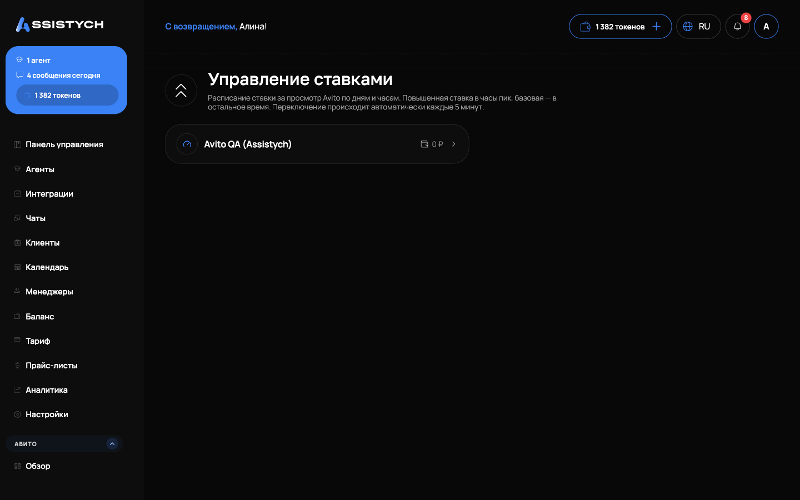

# Управление ставками

Раздел **Авито → Управление ставками** автоматически держит нужную позицию объявления в платной выдаче.

1. Откройте карточку объявления в разделе ставок.
2. Включите авто-ставку: укажите целевую позицию, город, ключевое слово и максимальную ставку.
3. Система сама поднимает и опускает ставку, не превышая ваш максимум.

На карточке видно текущую позицию, целевую, текущую ставку, рекомендацию и график позиции и расхода.


Объявления можно объединять в группы с общим бюджетом.

