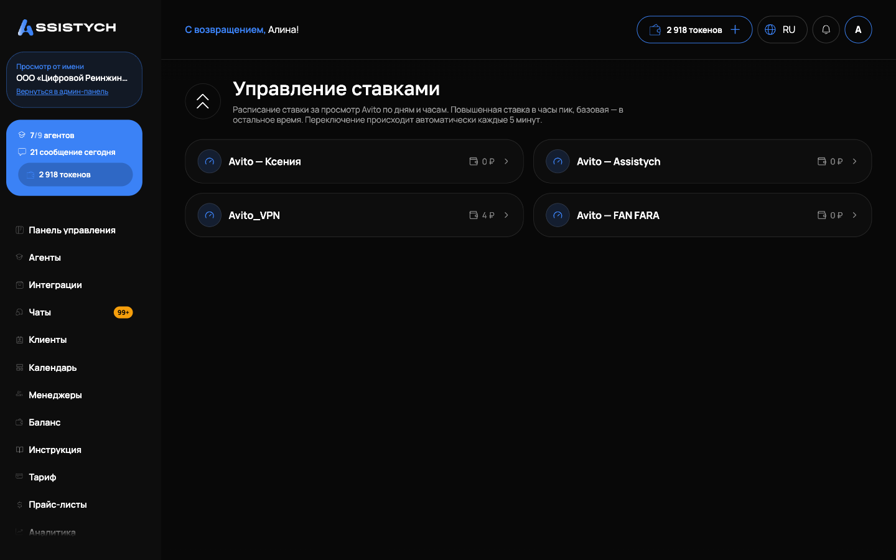
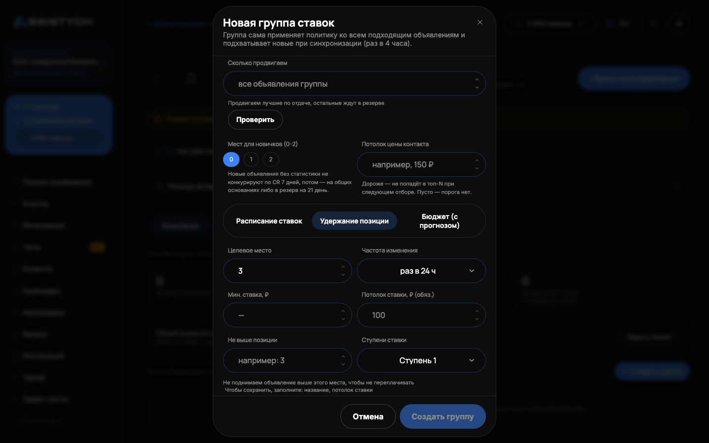

# Управление ставками

Раздел «Авито» → «Управление ставками» ведёт ставки за просмотры: расписание ставки по дням и часам (повышенная в часы пик, базовая в остальное время) и автоматическое удержание позиции в выдаче. Переключение ставки происходит автоматически каждые 5 минут. Раздел нужен, когда объявления продвигаются ставками CPA и вы хотите платить за позицию ровно столько, сколько нужно, не следя за торгами вручную.

Сначала открывается список подключённых аккаунтов Авито, у каждого виден баланс кошелька. Выберите аккаунт: внутри две вкладки, «Кампании» и «Объявления».

## Кампании

Кампания (группа ставок) применяет одну политику ко всем подходящим объявлениям и сама подхватывает новые при синхронизации, раз в 4 часа. Нажмите «Создать группу» и задайте:

- «Название», например «IT-услуги · Москва»;
- правила отбора: «Категории» и «Города», «Ничего не выбрано = любые». Дополнительно фильтры «Заголовок содержит» и «Заголовок не содержит» (слова через запятую);
- режим: «Расписание ставок» (пиковая и базовая ставка по дням и часам) или «Удержание позиции» (целевое место или диапазон, например 3–10);
- «Потолок ставки, ₽ (обяз.)»: выше него ставка не поднимется никогда. «Мин. ставка, ₽»: по каждому городу она своя, минимум Авито подставляется автоматически («Минимум по каждому городу автоматически»);
- «Частота изменения»: как часто двигать ставку. У групповых объявлений позиции замеряются раз в сутки, поэтому частота от 24 ч: реже дергать ставку значит не гоняться за плавающей выдачей и не сжигать бюджет;
- «Часы» работы (МСК): вне них ставка опускается к минимуму. Пусто: круглосуточно. Окно через полночь допустимо, например с 22 до 8;
- «Дневной лимит расхода группы, ₽»: при достижении лимита ставки участников опускаются до минимума до конца дня (по Москве). Отдельно задаётся «Общий дневной лимит расхода аккаунта».

Перед сохранением кнопка «Проверить» покажет, сколько объявлений подойдёт под правила. Для «Удержания позиции» можно задать «Ссылка на выдачу»: позиция замеряется внутри неё, со всеми фильтрами из ссылки. Ключевая фраза и город определяются автоматически по каждому объявлению.

Кампанию можно поставить на паузу переключателем на её карточке: появится бейдж «Пауза», торги остановятся. Удаление кампании выключает ставки её объявлений; история ставок и трат сохраняется.

Диапазон позиций дешевле жёсткой цели: система не переплачивает за первое место, если задан коридор. Но следите за шириной: если в правиле объявлений больше, чем позиций в диапазоне, они начнут вытеснять друг друга и сами поднимать ставку. Мы предупредим об этом в карточке кампании.

## Пул продвижения

Внутри кампании объявления делятся на состояния: под управлением, «продвигается» (в пуле, торги идут прямо сейчас) и «в резерве». Размер пула задаётся настройкой «Сколько продвигаем»: продвигаем лучшие по отдаче, остальные ждут в резерве.

В резерв уходят объявления, чья конверсия просела ниже порога пула (порог: конверсия худшего из продвигаемых сейчас). У них торги выключаются и продвижение снимается. При росте конверсии выше порога они возвращаются в торги автоматически. Вручную состав пула меняется кнопкой «Заменить в пуле»: на место убранного встанет следующее по отдаче.

## Вкладка «Объявления»

Здесь настраивается авто-позиция по одному объявлению. Нажмите «+ Взять под управление», выберите объявление из списка (видна текущая ставка и доступные ступени), затем на карточке включите «Включить авто-позицию» и укажите:

- «Целевая позиция» (или диапазон);
- «Максимальная ставка, ₽»: потолок, выше него ставка не поднимется;
- область замера: «Поисковый запрос» (как ищут клиенты) и «Город», либо «Ссылка на выдачу». Позиция замеряется внутри этой выдачи; пустая фраза со ссылкой: позиция при листании самой категории;
- «Как часто менять ставку»: позицию у автоставочных замеряем примерно каждые 5 минут, но ставка меняется не чаще выбранной частоты, чтобы не гоняться за плавающей выдачей Авито и не сжигать бюджет.

Система сравнивает место в поиске с целевым и раз в выбранный интервал двигает ставку на одну ступень вверх или вниз, никогда не выходя за ваш потолок. Если слов из запроса нет в заголовке объявления, покажем предупреждение: Авито считает объявление менее подходящим под запрос, и позиция обходится дороже.

На карточке видно текущую и целевую позицию, текущую ставку, потолок и график позиции и расхода. Разрыв линии на графике: день без замера позиции, это не сбой. После каждой смены ставки позиция перепроверяется автоматически примерно через 5 минут, эффект видно сразу, не дожидаясь планового замера.

Без авто-позиции работает расписание пиков: в пиковые окна действует пиковая ставка, вне окон базовая. Без расписания система просто держит базовую ставку. Авто-позиция, если включена, полностью замещает расписание. Шпаргалка «Как работают ставки: что чем перезаписывается» есть прямо на странице.

## Журнал применений

Каждая смена ставки записывается в «Журнал применений» на карточке объявления: когда, какая ставка была предложена и с каким результатом, «Применено», «Без изменений» или «Ошибка» с причиной. Типичные причины пропуска: «Авито не отдаёт продвижение по этому объявлению» или «нет средств на продвижение в аккаунте Авито». По журналу всегда можно понять, почему ставка двигалась или стояла.

## Деньги на продвижение: два счёта Авито

У Авито два счёта: основной кошелёк и аванс на продвижение (в кабинете Авито он может называться «аванс CPA», оплата целевых действий). Какой из них расходуется на показы, зависит от аккаунта; надёжный признак один: смотрите, какой из них убывает вместе с расходом.

При пустом авансе Авито может скрывать объявления из выдачи. Если продвижение встало, а кошелёк полный, проверьте аванс (и наоборот). Пополнение возвращает объявления в выдачу, и торги продолжаются сами. Когда деньги кончаются, система останавливается сама и пишет причину в журнал, ставки не крутятся вхолостую. Сторож баланса заранее предупреждает, когда аванса остаётся меньше чем на сутки расхода, и сообщает, когда он исчерпан (настраивается в уведомлениях, см. [Настройки](../settings/overview.md)).

## Если аккаунт на оплате за звонки и чаты

У таких аккаунтов ставок за просмотры нет в принципе: Авито отвечает «не получается получить продвижение». Раздел честно покажет, что Авито не даёт доступ к управлению ставками для этого аккаунта: это не ошибка сервиса, а модель оплаты аккаунта.

Для таких объявлений вместо ставок доступно [Продвижение с прогнозом](../promotion/forecast.md): готовые варианты бюджета от Авито с прогнозом просмотров. Остаётся доступен и трекинг позиций: кнопка «Позиция в выдаче» у объявления в [Мои объявления](../listings/overview.md), замер по запросу и городу без изменения ставки.

## Если что-то пошло не так

- Ставка не меняется, хотя авто-позиция включена. Посмотрите «Журнал применений»: там причина. Частые: достигнут потолок, выбранная частота изменения ещё не наступила, позиция уже в целевом диапазоне.
- В журнале «нет средств на продвижение в аккаунте Авито». Проверьте оба счёта Авито: кошелёк и аванс. Пополните тот, что убывает вместе с расходом.
- Объявления пропали из выдачи. Вероятно, пуст аванс на продвижение: пополните его в кабинете Авито, объявления вернутся сами.
- Кампания не подхватывает новые объявления. Состав обновляется при синхронизации раз в 4 часа; проверьте также правила отбора (категории, города, фильтры заголовка) кнопкой «Проверить».
- Раздел пишет, что Авито не даёт доступ к управлению ставками. Аккаунт на оплате за звонки и чаты: ставок у него нет. Используйте [Продвижение с прогнозом](../promotion/forecast.md) и трекинг «Позиция в выдаче».
- Объявления кампании вытесняют друг друга. Диапазон позиций уже, чем число объявлений: расширьте диапазон или уменьшите пул, о чём говорит предупреждение в карточке кампании.
