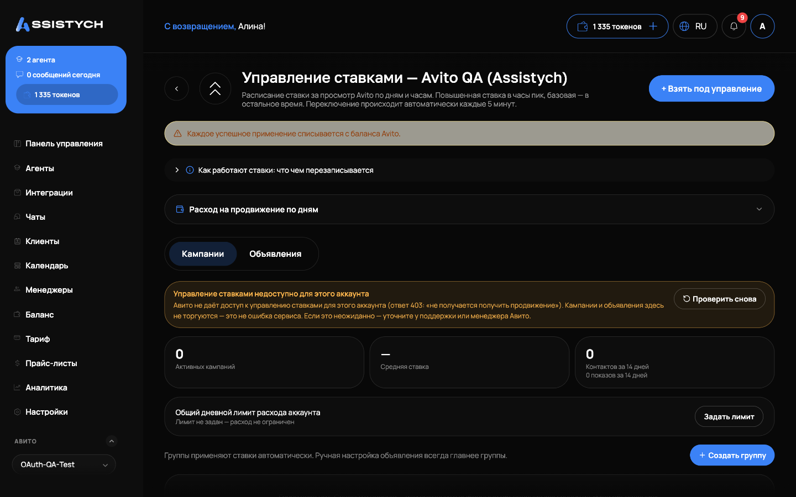

# Управление ставками

Раздел **Авито → Управление ставками** ведёт **ставки за просмотры**: расписание ставки по дням и часам (повышенная в часы пик, базовая в остальное время) и автоматическое удержание позиции. Переключение происходит автоматически каждые 5 минут.

Раздел состоит из двух вкладок: **«Кампании»** и **«Объявления»**.

## Кампании (группы ставок)

Кампания применяет одну политику ко всем подходящим объявлениям и **сама подхватывает новые** при синхронизации (раз в 4 часа).

При создании кампании задаются:

- **Название** и **правила отбора** — категории и города (ничего не выбрано = любые);
- **Режим**: «Расписание ставок» (пиковая и базовая ставка по дням и часам) или «Удержание позиции» (целевое место или диапазон, например 3–10);
- **Потолок ставки** (обязательно) и минимальная ставка — по каждому городу она своя, минимум Авито подставляется автоматически;
- **Частота изменения** — как часто двигать ставку, чтобы не гоняться за плавающей выдачей и не сжигать бюджет;
- **Часы работы** — вне них ставка опускается к минимуму. Пусто — круглосуточно; окно через полночь допустимо (например, с 22 до 8);
- **Дневной лимит расхода** — при достижении лимита ставки участников опускаются до минимума до конца дня (по Москве). Отдельно задаётся общий дневной лимит расхода всего аккаунта.

Кампанию можно поставить на **паузу** переключателем на её карточке — появится бейдж «Пауза», торги остановятся. Удаление кампании выключает ставки её объявлений; история ставок и трат сохраняется.


Диапазон позиций дешевле жёсткой цели: система не переплачивает за первое место, если задан коридор. Но следите за шириной: если в правиле объявлений больше, чем позиций в диапазоне, они начнут вытеснять друг друга и сами поднимать ставку — мы предупредим об этом в карточке кампании.


## Пул продвижения

Внутри кампании объявления делятся на три состояния: **под управлением**, **в пуле** (продвигаются прямо сейчас) и **в запасе**.

В запас уходят объявления, чья конверсия просела ниже порога пула (порог — конверсия худшего из продвигаемых сейчас): у них торги выключаются и продвижение снимается. При росте конверсии выше порога они **возвращаются в торги автоматически**. Вручную состав пула можно поменять кнопкой «Заменить в пуле».

## Вкладка «Объявления»

Здесь настраивается авто-позиция по одному объявлению:

1. Откройте карточку объявления.
2. Включите авто-позицию: укажите **целевую позицию** (или диапазон), **потолок ставки** и **область замера** — ключевую фразу или ссылку на категорию Авито. Позиция замеряется внутри этой выдачи.
3. Система сравнивает место в поиске с целевым и раз в выбранный интервал двигает ставку на одну ступень вверх или вниз, никогда не выходя за ваш потолок.

На карточке видно текущую и целевую позицию, текущую ставку и график позиции и расхода. Разрыв линии на графике — день без замера позиции, это не сбой.

## Журнал применений

Каждая смена ставки записывается в **журнал применений**: когда, по какому объявлению, какая ставка была предложена и с каким результатом — успех, пропуск или причина отказа (например, «Авито не отдаёт продвижение по этому объявлению» или «нет средств на продвижение в аккаунте Авито»). По журналу всегда можно понять, почему ставка двигалась или стояла.

## Деньги на продвижение: два счёта Авито

У Авито два счёта: **основной кошелёк** и **аванс на продвижение** (в кабинете Авито он может называться «аванс CPA» — оплата целевых действий). Какой из них расходуется на показы — зависит от аккаунта; надёжный признак один: смотрите, какой из них убывает вместе с расходом.


**При пустом авансе Авито может скрывать объявления из выдачи.** Если продвижение встало, а кошелёк полный — проверьте аванс (и наоборот). Пополнение возвращает объявления в выдачу, и торги продолжаются сами. Когда деньги кончаются, система останавливается сама и пишет причину в журнал — ставки не крутятся вхолостую. Сторож баланса заранее предупреждает, когда аванса остаётся меньше чем на сутки расхода.


## Если аккаунт на оплате за звонки и чаты

У таких аккаунтов ставок за просмотры нет в принципе — Авито отвечает «не получается получить продвижение». Раздел честно покажет: **«Авито не даёт доступ к управлению ставками для этого аккаунта»** — это не ошибка сервиса, а модель оплаты аккаунта.

Для таких объявлений вместо ставок доступно **«Продвижение с прогнозом»** — готовые варианты бюджета от Авито с прогнозом просмотров. Подробнее — на странице «Продвижение с прогнозом». Остаётся доступен и трекинг позиций: кнопка «Позиция в выдаче» у объявления.
