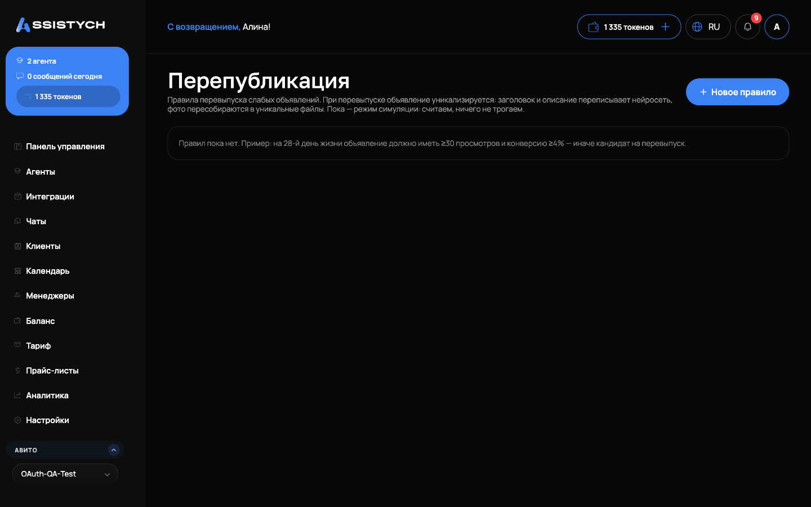

# Конвейер

Раздел **Авито → Конвейер** — это конвейер перепубликации: он снимает «мёртвые» и деградирующие объявления, выжидает паузу и перевыпускает их, чтобы они не теряли позиции в выдаче со временем.


**Живые шаги — только по кнопке «Опубликовать».** Конвейер готовит снятия и перевыпуски черновиками, а реально на Авито они уходят при публикации фида — вручную или по расписанию.


## Как выглядит работа

Объявления движутся по колонкам:

- **Кандидаты** — объявления без контактов или с падением статистики за период оценки;
- **Снятие (черновик)** — снятие подготовлено, ждёт публикации фида;
- **Сняты** — сняты с Авито, идёт пауза («остывает, N дней»);
- **К перевыпуску** — пауза прошла, черновик новой версии готов;
- **Завершены** — цикл закончен.

Действия по каждому объявлению: **«Снять»**, **«Перевыпустить»**, **«Оставить»** (не трогать), **«Убрать»** (убрать из конвейера).

## Автоматический режим

При включённом авто-режиме конвейер сам зачисляет мёртвые и деградирующие объявления, снимает их черновиком и перевыпускает после паузы. Настройки:

- **Период оценки** — за сколько дней смотреть статистику (7–30);
- **Пауза до перезапуска** — сколько дней объявление «остывает» между снятием и перевыпуском (7–60);
- **Действий за тик** — максимум действий за один проход.


Если авто-режим включён, но авто-публикация фида выключена, изменения копятся черновиком до нажатия «Опубликовать» — конвейер ничего не снимет и не перевыпустит без публикации.


## А/Б-тесты

Конвейер умеет сравнивать два варианта объявления: старое против нового. По итогам тестового периода видно просмотры и контакты каждой стороны; кнопка **«Оставить это»** фиксирует победителя, проигравший снимается черновиком (опубликуйте фид). Тест можно отменить — тогда оба варианта остаются.

