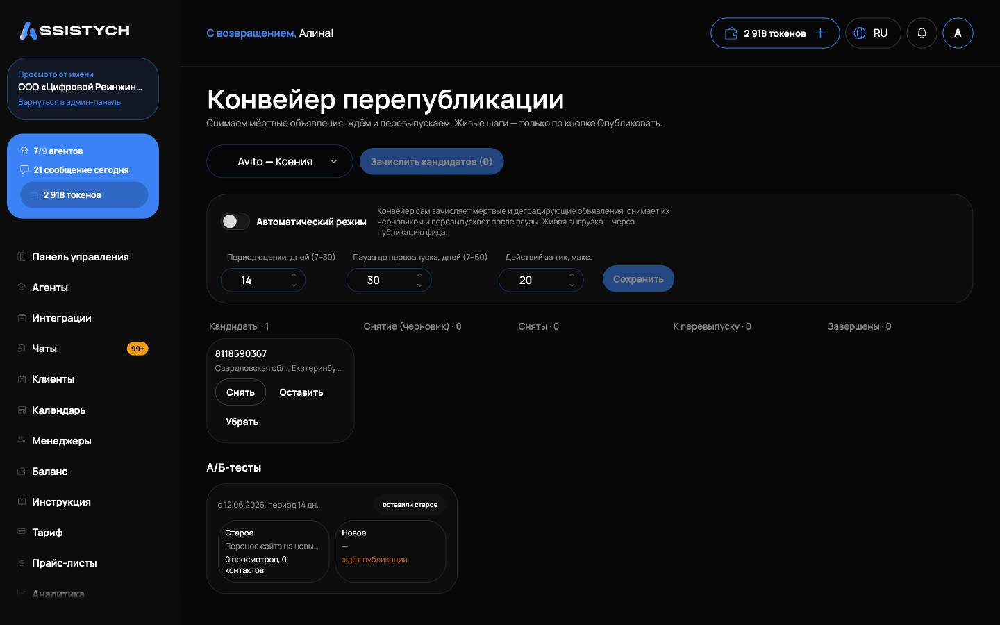

# Конвейер

Раздел «Авито» → «Конвейер»: конвейер перепубликации. Он снимает «мёртвые» и деградирующие объявления, выжидает паузу и перевыпускает их заново, чтобы они не теряли позиции в выдаче со временем. Нужен, когда объявления постепенно «застревают» внизу выдачи и перестают приносить контакты.

Важно: живые шаги идут только по кнопке «Опубликовать». Конвейер готовит снятия и перевыпуски черновиками, а реально на Авито они уходят при публикации фида: вручную или по расписанию автозагрузки. Подробнее про фид и публикацию: [Автозагрузка и публикация](../listings/autoload.md).

## Как выглядит работа

Объявления движутся по колонкам:

- «Кандидаты»: объявления без контактов за период оценки или с падением статистики (бейдж «падение статистики»);
- «Снятие (черновик)»: снятие подготовлено, ждёт публикации фида;
- «Сняты»: сняты с Авито, идёт пауза, на карточке видно «остывает, N дн.»;
- «К перевыпуску»: пауза прошла, черновик новой версии готов;
- «Завершены»: цикл закончен (перевыпущено, оставлено или исключено).

У каждой карточки на доске видны название объявления, город и бейджи. Число у заголовка колонки: сколько объявлений сейчас в этом состоянии.

Действия по каждому объявлению: «Снять», «Перевыпустить», «Оставить» (не трогать, цикл завершён), «Убрать» (исключить из конвейера). Кнопки «Снять» и «Перевыпустить» работают только для объявлений из управляемого фида; иначе подсказка «Сначала добавьте в управляемый фид».

Зачислить кандидатов можно кнопкой «Зачислить кандидатов (N)» над доской: рядом видно, сколько из них без контактов, а сколько с падением статистики. Вручную в конвейер объявление ставится из [Мои объявления](../listings/overview.md), действие «В конвейер» у строки.

При перевыпуске создаётся копия объявления: текст переписывается и фото уникализируются, чтобы новая версия не считалась дублем старой. После действия появляется подсказка «Создан черновик, опубликуйте фид». Текущее состояние конвейера видно и в списке [Мои объявления](../listings/overview.md): колонка «Конвейер» показывает этап и дату перезапуска.

## Автоматический режим

Переключатель «Автоматический режим»: конвейер сам зачисляет мёртвые и деградирующие объявления, снимает их черновиком и перевыпускает после паузы. Настройки:

- «Период оценки, дней (7–30)»: за сколько дней смотреть статистику;
- «Пауза до перезапуска, дней (7–60)»: сколько объявление «остывает» между снятием и перевыпуском;
- «Действий за тик, макс.»: сколько действий разрешено за один проход, чтобы конвейер не снял полаккаунта за раз.

После изменений нажмите «Сохранить».

Если авто-режим включён, но авто-публикация фида выключена, страница покажет предупреждение: изменения копятся черновиком до нажатия «Опубликовать». Конвейер ничего не снимет и не перевыпустит без публикации. Включить авто-публикацию можно в настройках фида: «Обновлять Авито автоматически», см. [Автозагрузка и публикация](../listings/autoload.md).

Если конвейер выключен для аккаунта, вверху страницы баннер «Конвейер выключен для этого аккаунта».

## А/Б-тесты

Конвейер умеет сравнивать два варианта объявления: старое против нового. Тест запускается из [Мои объявления](../listings/overview.md), действие «А/Б-тест: запустить копию рядом»: создаётся уникализированная копия, которая публикуется рядом с оригиналом.

В блоке «А/Б-тесты» внизу страницы у каждого теста видно: дату старта и период, статистику обеих сторон («N просмотров, N контактов»), бейдж «пора решить», когда тестовый период прошёл. Пока копия не опубликована, у неё статус «ждёт публикации».

Кнопка «Оставить это» фиксирует победителя: проигравший снимается черновиком, и это изменение уйдёт на Авито при следующей публикации фида. «Отменить тест (оба остаются)»: оба варианта продолжают жить, решение не принимается.

## Если что-то пошло не так

- Кнопка «Снять» или «Перевыпустить» неактивна. Объявления нет в управляемом фиде: добавьте его через [Мои объявления](../listings/overview.md), действие «Взять в управление».
- Объявления висят в «Снятие (черновик)» и ничего не происходит. Живых шагов без публикации нет: нажмите «Опубликовать» в фиде или включите авто-публикацию.
- Авто-режим включён, но конвейер молчит. Проверьте предупреждение про авто-публикацию фида и лимит «Действий за тик»: возможно, дневная порция действий уже исчерпана.
- Кандидатов ноль, хотя объявления старые. Статистика считается за «Период оценки»: уменьшите его (минимум 7 дней) или проверьте, что у аккаунта накопилась статистика просмотров и контактов.
- Перевыпущенное объявление выглядит точной копией старого. Уникализация текста и фото идёт в фоне; если она не прошла, отредактируйте черновик вручную перед публикацией.
- Тест завершён, а проигравший не снялся с Авито. Решение снимает его черновиком: опубликуйте фид, чтобы снятие ушло на Авито.
