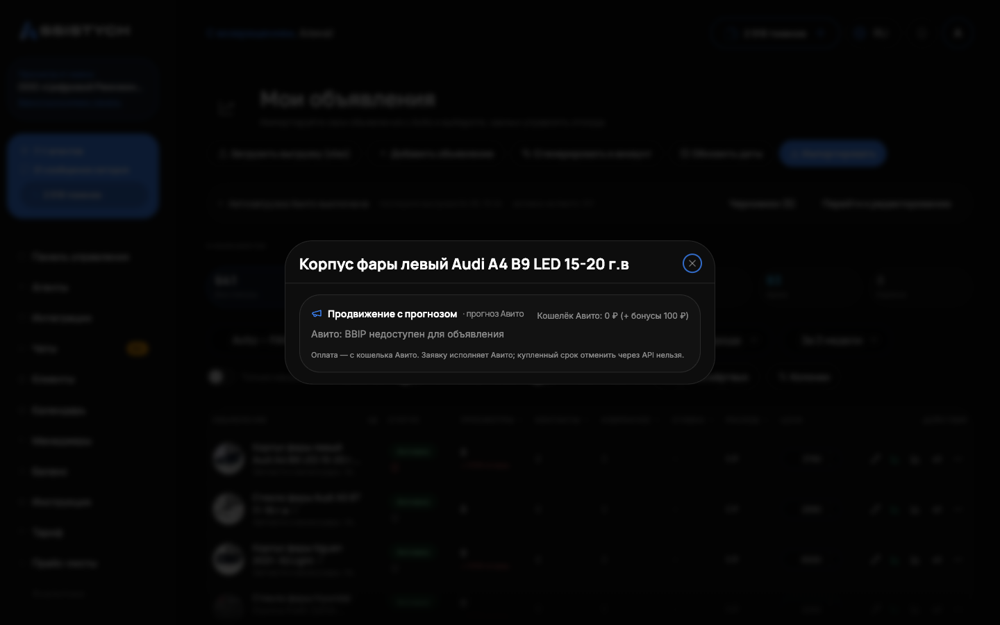

# Продвижение с прогнозом

«Продвижение с прогнозом»: готовые варианты бюджета от Авито с прогнозом просмотров, для объявлений, где ставок нет. Вместо торгов за позицию Авито сам предлагает варианты «столько-то рублей в день на столько-то дней» и к каждому прогноз прироста просмотров. Нужно, когда аккаунт на оплате за звонки и чаты и [Управление ставками](../promotion/bids.md) недоступно, либо когда вы хотите предсказуемый бюджет вместо торгов.

## Где найти

- В разделе [Мои объявления](../listings/overview.md): кнопка с мегафоном в строке объявления;
- в разделе [Управление ставками](../promotion/bids.md): на карточке объявления.

## Что показывает

Блок запрашивает варианты напрямую у Авито и показывает только то, что пришло от Авито или посчитано из ваших данных:

- варианты бюджета в ₽/день, рекомендованный Авито вариант помечен;
- срок продвижения в днях;
- прогноз Авито до траты, например «за 7 дней: 6 776 ₽ → +31…157 просмотров»: сумма и вилка просмотров дословно от Авито;
- кошелёк Авито с пометкой, на какое время данные;
- если продвижение уже куплено, строка «Продвигается до …» с пометкой, куплено оно у нас или в кабинете Авито. Покупку из кабинета мы видим и честно показываем, поверх неё новую заявку не создаём.

Если для объявления продвижение недоступно, показываем причину словами Авито: «недоступно для объявления в этом статусе», «для этого объявления продвижение недоступно» или «Авито не даёт этому аккаунту доступ к продвижению». Это ответ Авито, а не ограничение нашего сервиса.

## Как оплачивается

Оплата только с кошелька Авито этого аккаунта. Не с аванса на продвижение, не с баланса Ассистыч и не с банковской карты, только с кошелька. Если на кошельке не хватает суммы заявки, пополните кошелёк в кабинете Авито и повторите. Про два счёта Авито и сторож баланса читайте в [Управление ставками](../promotion/bids.md).

## Подключение и отмена

Подключить продвижение пока можно в кабинете Авито. Мы увидим покупку и покажем её как купленную в кабинете, со сроком окончания.

Купленный срок отменить нельзя: продвижение доработает до конца оплаченного периода. «Остановить» продвижение означает только одно: не продлевать следующий срок.

## Важно понимать

- Прогноз: это обещание Авито, а не гарантия позиции. Продвижение поднимает просмотры, конкретное место в выдаче оно не обещает.
- Варианты бюджета у каждого объявления свои: Авито считает их по категории и региону.
- Если Авито изменит цены между просмотром и подключением, сумма пересчитается: мы попросим подтвердить её заново, а не спишем молча.

Рядом, во вкладке «Продвижение» редактора объявления, доступны и пакеты продвижения Авито: «До N× просмотров» на 1 или 7 дней, «XL-объявление», «Выделение цветом». Там же видны уже активные услуги со сроком окончания. Подключение тоже идёт с кошелька Авито и всегда с подтверждением суммы. Подробнее про редактор: [Редактирование объявления](../listings/editor.md).

## Если что-то пошло не так

- Кнопки или вариантов бюджета нет. Объявлению продвижение недоступно: прочитайте причину в блоке, она дана словами Авито. Часто помогает смена статуса объявления (например, публикация из архива).
- «На кошельке не хватает». Пополните именно кошелёк Авито, а не аванс: с аванса эта услуга не оплачивается.
- После нажатия сумма изменилась и покупка не прошла. Авито пересчитал цену: подтвердите новую сумму ещё раз, молча мы ничего не списываем.
- Ошибка при подключении. Ошибка Авито не означает, что услуга не куплена: состояние перечитывается автоматически. Проверьте строку «Продвигается до …» прежде чем повторять, чтобы не купить дважды.
- Продвижение куплено, а просмотры не выросли. Прогноз: обещание Авито, а не гарантия. Проверьте срок действия и сравните статистику за период продвижения с предыдущим в [Аналитике](../analytics/overview.md).
- Хочу отменить купленное. Отменить оплаченный срок нельзя, он доработает до конца. Можно только не продлевать следующий.
