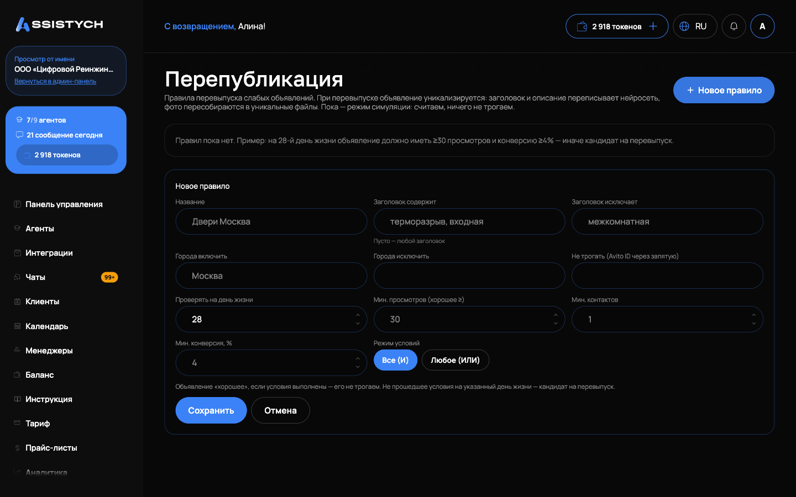
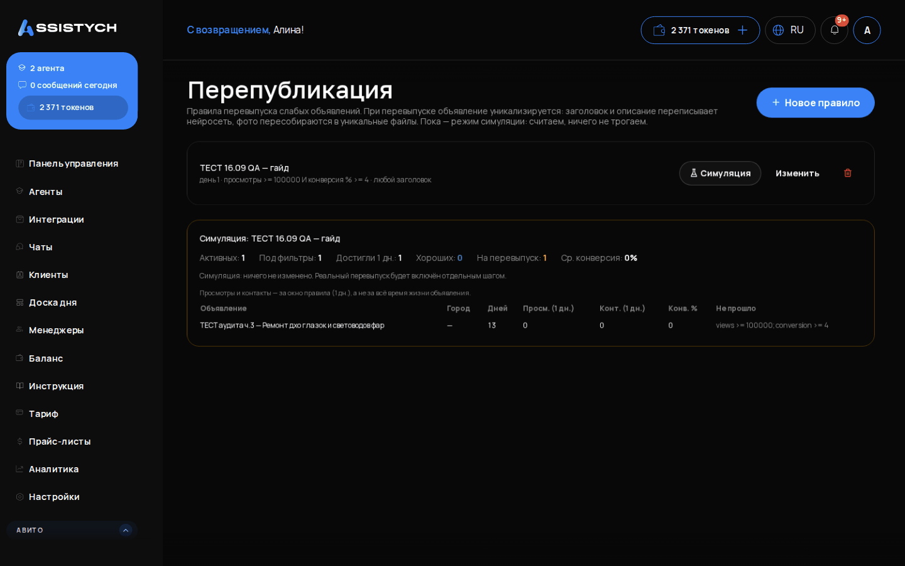

# Перепубликация

Раздел «Авито» → «Перепубликация»: правила перевыпуска слабых объявлений. Вы описываете, какое объявление считать «хорошим» (сколько просмотров, контактов и какая конверсия у него должны быть к определённому дню жизни), а раздел находит всех, кто до этой планки не дотянул. Такие объявления: кандидаты на перевыпуск, то есть на снятие и повторную публикацию с уникализацией.

Сейчас раздел работает в режиме симуляции: правила можно создавать и прогонять, считаем и показываем результат, но ничего не изменяем. Реальный перевыпуск (архив, затем новое объявление) будет включён отдельным шагом. Поэтому раздел полезен уже сейчас как проверка критериев: вы заранее видите, сколько и какие объявления попадут под перевыпуск, и успеваете подправить правило.

Если вам нужен рабочий перевыпуск уже сегодня, он живёт в соседнем разделе [Конвейер](../promotion/conveyor.md): он снимает и перевыпускает объявления черновиками фида. «Перепубликация» отвечает на вопрос «кого перевыпускать», а «Конвейер»: «как это исполнить».

Перед началом выберите аккаунт Авито в переключателе слева: правила создаются отдельно для каждого аккаунта.

## Создание правила

Нажмите «Новое правило» и заполните форму:

- «Название»: для себя, например «Двери Москва»;
- «Заголовок содержит»: слова через запятую, которые должны быть в заголовке. Пусто: любой заголовок;
- «Заголовок исключает»: объявления с этими словами правило не трогает;
- «Города включить» и «Города исключить»: ограничение по географии;
- «Не трогать (Avito ID через запятую)»: конкретные объявления, которые правило обходит;
- «Проверять на день жизни»: возраст объявления в днях, на котором его оценивают (по умолчанию 28);
- условия «хорошего» объявления: «Мин. просмотров (хорошее ≥)», «Мин. контактов», «Мин. конверсия, %». Заполнять можно любую комбинацию;
- «Режим условий»: «Все (И)»: объявление хорошее, только если выполнены все заданные условия; «Любое (ИЛИ)»: достаточно одного.

Нажмите «Сохранить». Правило появится в списке с краткой записью: день жизни, условия, фильтры заголовка и городов.

## Как читать правило

Логика такая: объявление «хорошее», если условия выполнены, его не трогаем. Объявление, которое достигло указанного дня жизни, но условия не прошло, становится кандидатом на перевыпуск.

Пример из подсказки в интерфейсе: на 28-й день жизни объявление должно иметь не меньше 30 просмотров и конверсию не ниже 4%, иначе это кандидат на перевыпуск.

При перевыпуске объявление будет уникализировано: заголовок и описание перепишет нейросеть, фото пересоберутся в уникальные файлы, чтобы новая версия не считалась дублем старой.

## Симуляция

У каждого правила в списке есть кнопка «Симуляция». Это сухой прогон: ничего не меняется, показывается только расчёт по текущим данным аккаунта.

Результат симуляции:

- «Активных»: сколько активных объявлений в аккаунте всего;
- «Под фильтры»: сколько из них попало под фильтры правила (заголовок, города, исключения);
- «Достигли N дн.»: сколько уже доросли до дня оценки; молодые не анализируются;
- «Хороших»: сколько прошли условия;
- «На перевыпуск»: сколько не прошли и стали кандидатами;
- «Ср. конверсия» по проверенным объявлениям.

Ниже таблица кандидатов: название (со ссылкой на Авито), город, возраст в днях, просмотры и контакты, конверсия в процентах и колонка «Не прошло», где перечислено, какие именно условия не выполнены.

Важно: просмотры и контакты в таблице считаются за окно правила (столько же дней, сколько «день жизни»), а не за всё время жизни объявления. Цифры в кабинете Авито будут больше, там сумма за всё время.

Под таблицей всегда напоминание: симуляция ничего не изменила. Если кандидатов больше, чем вы ожидали, скорректируйте условия кнопкой «Изменить» у правила и прогоните симуляцию ещё раз. Лишние правила удаляются кнопкой с корзиной, с подтверждением.

## Если что-то пошло не так

- Раздел просит выбрать аккаунт. Правила привязаны к аккаунту Авито: выберите его в переключателе слева. Если аккаунта нет, подключите его по инструкции [Подключение Авито](../getting-started/connect-avito.md).
- «Под фильтры» ноль. Слишком узкие фильтры: проверьте слова в «Заголовок содержит» (опечатка отсекает всё), список городов и исключённые Avito ID.
- «Достигли N дн.» ноль, хотя объявления старые. Возраст считается от даты публикации на Авито; у части объявлений она может быть неизвестна. Обновить даты можно в [Мои объявления](../listings/overview.md), кнопка «Обновить даты».
- Все объявления «хорошие», кандидатов нет. Условия слишком мягкие или выбран режим «Любое (ИЛИ)» с низкими порогами. Поднимите пороги или переключите режим на «Все (И)».
- Цифры просмотров не совпадают с кабинетом Авито. Это ожидаемо: в симуляции статистика за окно правила, у Авито за всё время жизни объявления.
- Хочу, чтобы перевыпуск пошёл сам. Пока раздел только считает: автоматический перевыпуск будет включён отдельным шагом. Рабочий цикл снятия и перевыпуска уже доступен в [Конвейере](../promotion/conveyor.md).
