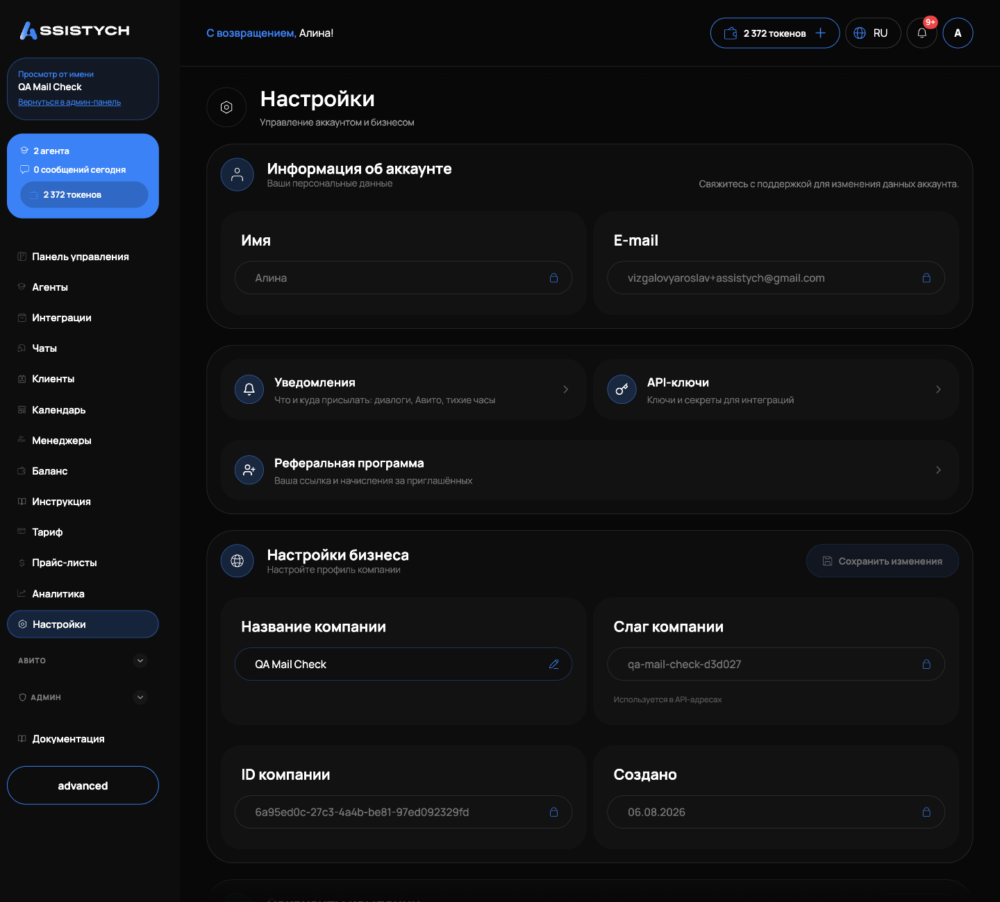
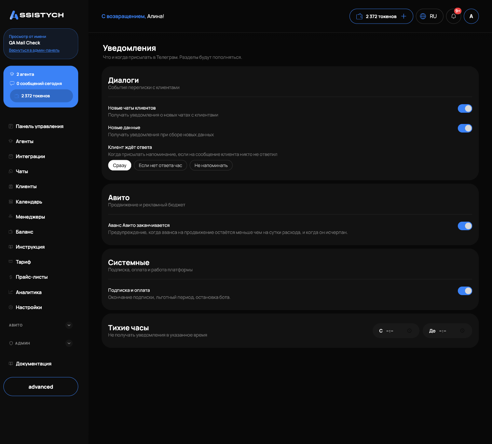
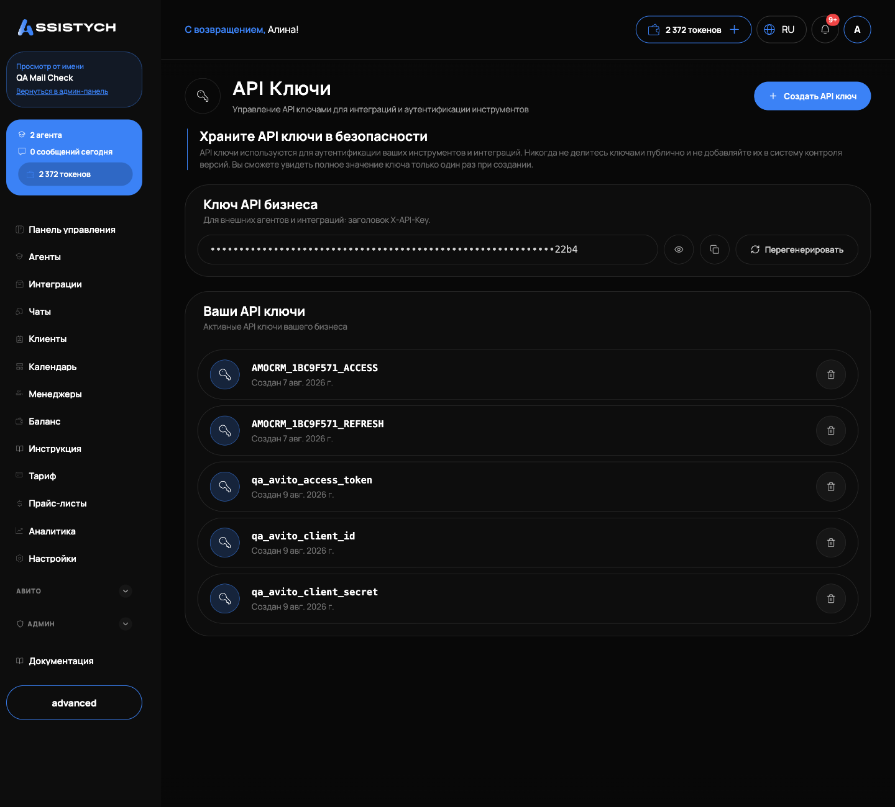

# Настройки и API-ключи

Раздел «Настройки» хранит данные аккаунта и компании, привязку Telegram для уведомлений и API-ключи для интеграций. Открывается из левого меню, пункт «Настройки». Менеджер видит сокращённую версию страницы: только личные данные, уведомления и привязку Telegram (подробнее в [Менеджерах и ролях](../managers/overview.md)).

## Страница «Настройки»

Сверху блок «Информация об аккаунте»: поля «Имя» и «E-mail». Они только для чтения, рядом подсказка «Свяжитесь с поддержкой для изменения данных аккаунта».

Ниже карточки-переходы в подразделы:

- «Уведомления»: что и куда присылать, диалоги, Авито, тихие часы;
- «API-ключи»: ключи и секреты для интеграций;
- «Реферальная программа»: ваша ссылка и начисления за приглашённых.

Блок «Настройки бизнеса»:

- «Название компании»: единственное редактируемое поле. Измените и нажмите «Сохранить изменения», появится подтверждение «Настройки сохранены»;
- «Слаг компании»: короткий идентификатор, «Используется в API-адресах», не редактируется;
- «ID компании» и «Создано»: технические данные, только для чтения.

Блок «Опасная зона» содержит «Удалить бизнес» с описанием «Безвозвратно удалить бизнес и все данные». Кнопка сейчас неактивна: удаление через кабинет недоступно.

## Привязка Telegram владельца

Карточка «Telegram» на странице настроек привязывает ваш личный Telegram к кабинету. На неё приходят уведомления о работе бизнеса, и с телефона можно управлять чатами.

Как привязать:

1. Нажмите «Получить код». Появится код из цифр и таймер «Истекает через …».
2. Откройте @AssistychBot в Telegram.
3. Нажмите кнопку «Открыть чаты».
4. Введите этот код.

[скриншот: карточка «Telegram» с кодом привязки]

Если код истёк, нажмите «Новый код». После привязки карточка показывает «Подключён как @username» и дату подключения. Кнопка «Отключить» снимает привязку, уведомления перестанут приходить.

## Уведомления

Подраздел «Уведомления» (карточка на странице настроек) управляет тем, что приходит в привязанный Telegram. Подпись на странице честно предупреждает: «Что и когда присылать в Телеграм. Разделы будут пополняться».

Если Telegram не привязан, страница показывает подсказку «Уведомления приходят в Телеграм. Сначала привяжите аккаунт в Настройках» и кнопку «Привязать Телеграм». Переключатели станут доступны после привязки.

Раздел «Диалоги», события переписки с клиентами:

- «Новые чаты клиентов»: уведомления о новых чатах;
- «Новые данные»: уведомления при сборе новых данных агентом;
- «Клиент ждёт ответа»: когда присылать напоминание, если на сообщение клиента никто не ответил. Варианты: «Сразу», «Если нет ответа час», «Не напоминать».

Раздел «Авито», продвижение и рекламный бюджет:

- «Аванс Авито заканчивается»: предупреждение, когда аванса на продвижение остаётся меньше чем на сутки расхода, и когда он исчерпан.
Раздел «Системные», подписка, оплата и работа платформы:

- «Подписка и оплата»: окончание подписки, льготный период, остановка бота.

Отдельный блок «Тихие часы»: «Не получать уведомления в указанное время». Задайте время «С» и «До», в этот промежуток уведомления не придут. Кнопка «Очистить» убирает тихие часы.

Все переключатели сохраняются сразу, отдельной кнопки «Сохранить» нет.

## API-ключи

Подраздел «API Ключи» (карточка «API-ключи» на странице настроек) хранит ключи внешних сервисов, которые нужны вашим инструментам и интеграциям: например, ключ сторонней нейросети или внешнего API.

Вверху страницы предупреждение «Храните API ключи в безопасности»: не публикуйте ключи и не добавляйте их в систему контроля версий, полное значение видно только один раз при создании.

Создание ключа:

1. Нажмите «Создать API ключ».
2. В диалоге заполните «Название», например OPENAI_API_KEY. Подсказка: «Будет преобразовано в верхний регистр с подчёркиваниями».
3. Заполните «Значение API ключа» (в поле подсказка «sk-...»). Под полем написано: «Это значение будет зашифровано и не может быть получено позже».
4. Нажмите «Создать ключ».
5. Появится окно «API ключ создан» с именем и значением. Скопируйте значение сразу кнопкой копирования: после закрытия окна кнопкой «Готово» увидеть его снова не получится.

Список «Ваши API ключи» показывает только названия ключей и дату «Создан {дата}», значения скрыты навсегда. Если значение потеряно, удалите ключ и создайте новый с тем же названием.

Удаление: кнопка корзины в строке ключа, с подтверждением «Вы уверены, что хотите удалить этот API ключ? Это действие нельзя отменить». После удаления интеграции, которые пользовались этим ключом, перестанут работать, пока им не зададут новый.

## Если что-то пошло не так

- Уведомления не приходят. Проверьте, что карточка «Telegram» показывает «Подключён как @username», нужный переключатель включён и событие не попадает в «Тихие часы».
- Код привязки Telegram не принимается. У него короткий срок действия: нажмите «Новый код» и введите свежий в @AssistychBot.
- На странице «Уведомления» нет переключателей, только подсказка про привязку. Сначала привяжите Telegram в «Настройках», затем вернитесь.
- Потеряли значение API-ключа. Восстановить нельзя, оно не хранится в открытом виде: удалите ключ и создайте новый с тем же названием.
- «Не удалось создать секрет». Проверьте, что заполнены оба поля, «Название» и «Значение API ключа», и повторите.
- Не получается изменить имя или почту аккаунта. Эти поля не редактируются в кабинете, обратитесь в поддержку.
